# LexAI

AI-powered contract and legal document intelligence SaaS.

LexAI is a full-stack MVP in the ApexGroup product ecosystem. It gives legal, operations, and startup teams a premium workspace for uploading contracts, running mock AI analysis, reviewing clause and risk findings, generating reports, and exploring document-aware chat flows.

Built by Anchal Shukla.

## Overview

LexAI demonstrates the product and engineering foundation for a legal document intelligence platform. The current app includes a polished Next.js frontend, an Express + TypeScript API, PostgreSQL persistence through Prisma, JWT-based authentication, document upload, mock analysis persistence, reports, chat detail views, and an auth-aware workspace shell.

The current AI layer is intentionally mocked. It persists realistic analysis outputs so the full product flow can be demonstrated without claiming production OCR, extraction, or legal reasoning. Real OCR and LLM integrations are planned.

## Project Documentation

- [Case Study](docs/CASE_STUDY.md)
- [Project Overview](docs/PROJECT_OVERVIEW.md)
- [Demo Guide](docs/DEMO_GUIDE.md)
- [API Overview](docs/API_OVERVIEW.md)
- [Architecture Overview](docs/ARCHITECTURE_OVERVIEW.md)
- [MVP Checklist](docs/MVP_CHECKLIST.md)
- [Screenshot Guide](docs/SCREENSHOTS.md)

## Key Features

- Premium SaaS dashboard with workspace-aware data.
- Auth signup, login, logout, and authenticated workspace mode.
- Demo Mode fallback when no token is present or backend data is unavailable.
- Document create and upload flow for legal files.
- Mock AI risk analysis persisted in PostgreSQL.
- Clause findings, risk findings, and recommendations.
- Report generation and report detail views.
- AI chat mock grounding against seeded or uploaded document context.
- Documents library with backend-backed data and fallback content.
- Settings/profile page for workspace presentation.
- Auth-aware shell with `Signed in` and `Demo Mode` states.

## Tech Stack

### Frontend

- Next.js App Router
- TypeScript
- Tailwind CSS
- shadcn-compatible UI primitives
- Framer Motion
- lucide-react icons

### Backend

- Node.js
- Express
- TypeScript
- Prisma
- PostgreSQL
- JWT
- bcryptjs
- multer

### Development

- npm workspaces
- Prisma Studio
- ESLint
- TypeScript
- Docker Compose support for local infrastructure

## Architecture

```text
Next.js Frontend
-> API client with optional JWT
-> Express API
-> Request context resolver
-> Prisma services
-> PostgreSQL
```

The frontend sends an `Authorization: Bearer <token>` header when `lexai_token` exists. Backend routes that support optional authentication use the authenticated workspace when a valid JWT is provided and fall back to the seeded demo workspace when no token is provided.

## Screens

- Landing page
- Login and signup
- Dashboard
- Documents
- Upload
- Contract analysis
- AI chat
- Reports
- Settings

## Screenshots

All screenshots use demo/test data. No real legal documents or secrets are shown.

### Landing Page
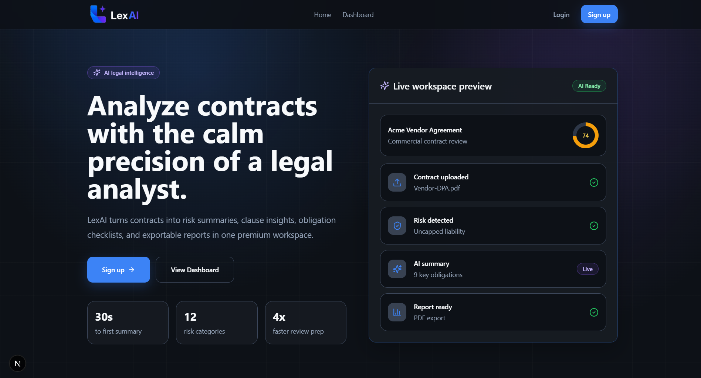

### Dashboard
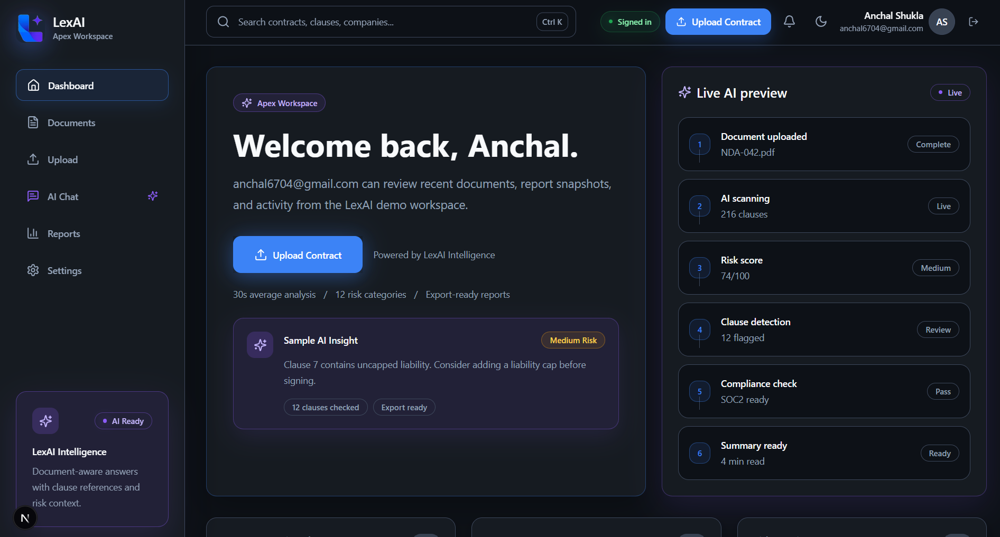

### Upload Flow
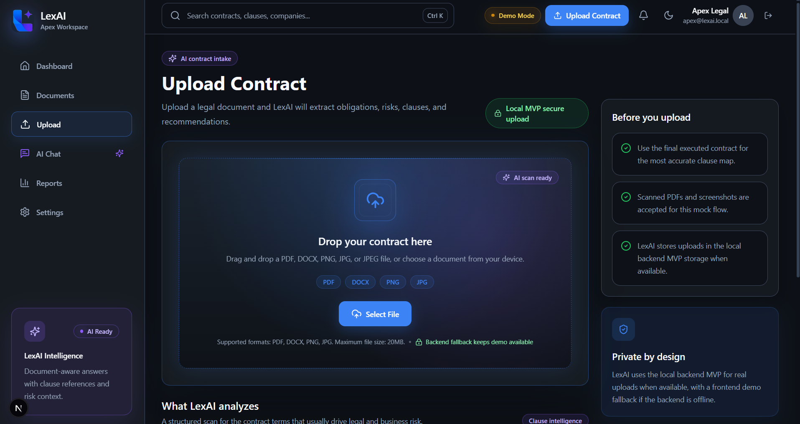

### Contract Analysis
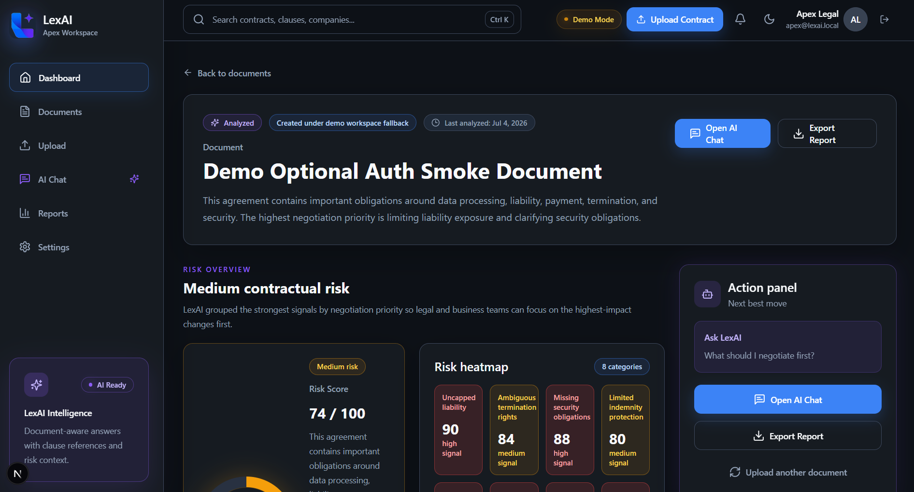

### AI Chat
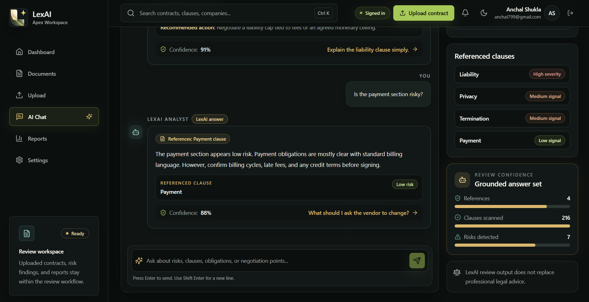

### Reports
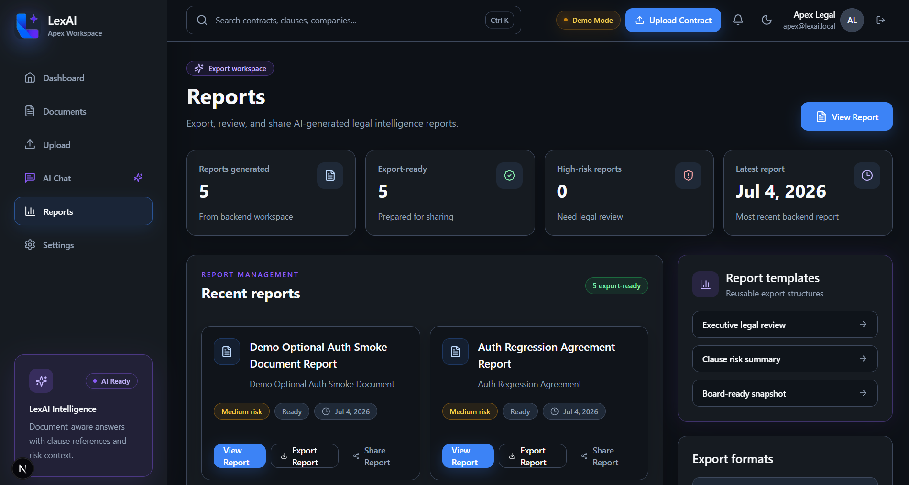

### Report Analysis
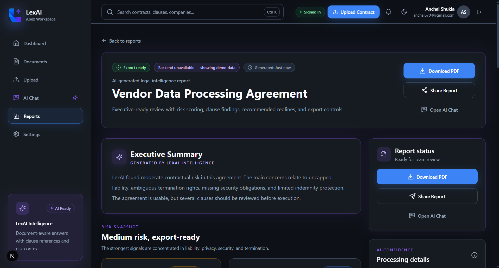

### Settings
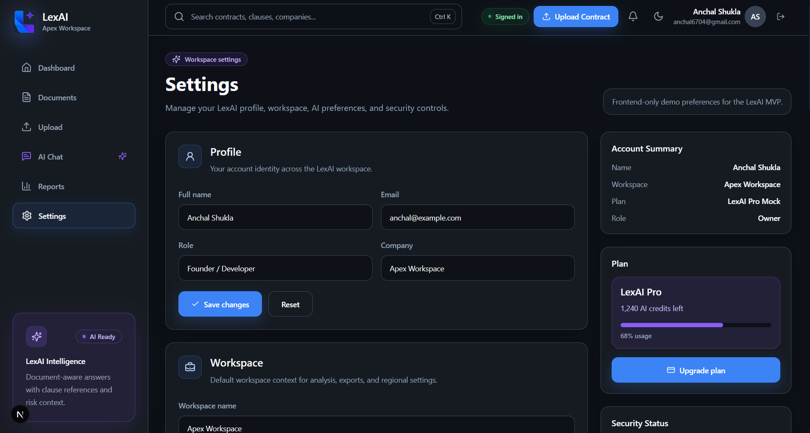

### Documents
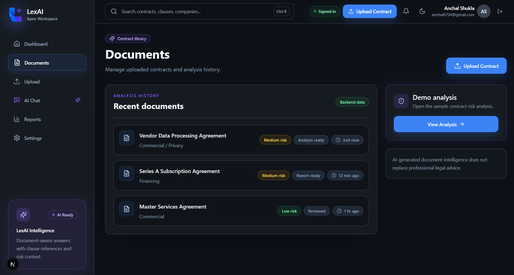

### Login
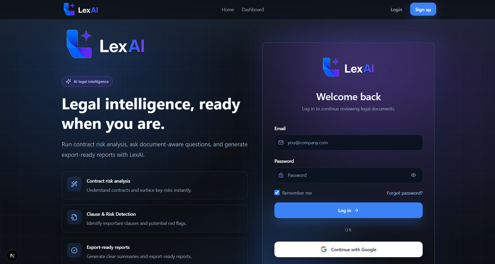

### Signup
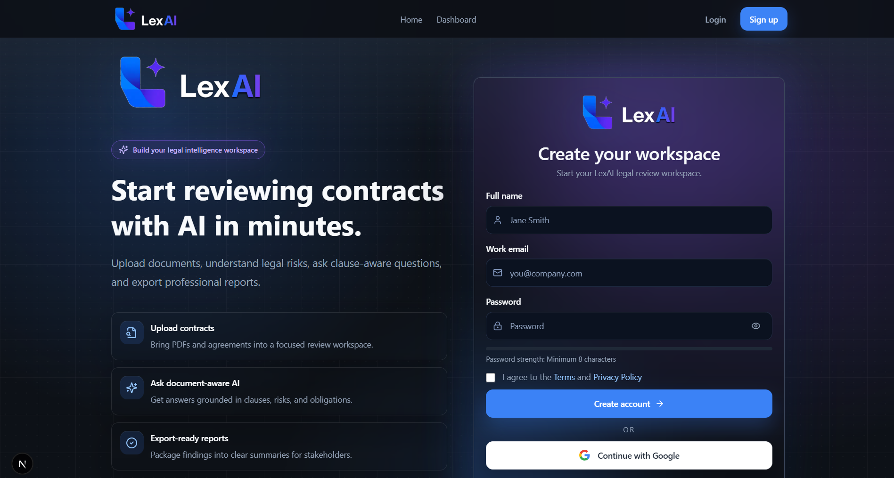

### Dashboard Demo Mode
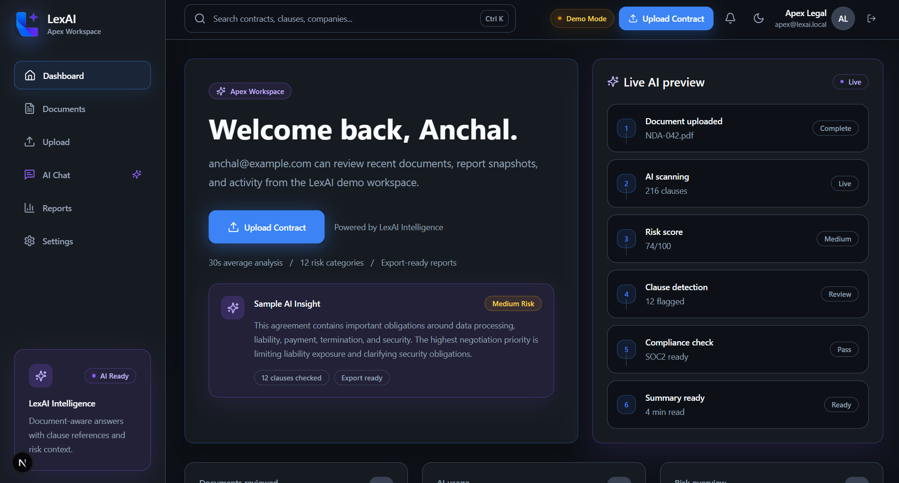

See [docs/SCREENSHOTS.md](docs/SCREENSHOTS.md) for the recommended capture list, file names, and safety notes.

## Backend Capabilities

- Auth session creation with hashed passwords and JWTs.
- Auth-aware request context resolution.
- Demo workspace fallback for optional-auth routes.
- Document CRUD.
- File upload metadata through multer.
- Mock analysis generation and persistence.
- Report listing and report detail retrieval.
- Chat session detail retrieval.
- Standard success, paginated, and error response envelopes.

## Local Setup

### Prerequisites

- Node.js 22 LTS recommended.
- npm 10+.
- PostgreSQL running locally.
- Optional: Docker Desktop if using the Docker Compose workflow.

### Install Dependencies

Windows:

```bash
npm.cmd install
```

Cross-platform:

```bash
npm install
```

### Environment Files

Create backend and frontend environment files:

```bash
copy backend\.env.example backend\.env
copy frontend\.env.example frontend\.env.local
```

Do not commit `.env` files.

## Environment Variables

### Backend

```bash
DATABASE_URL="postgresql://postgres:<password>@localhost:5432/lexai?schema=public"
JWT_SECRET="replace-with-a-long-development-secret"
JWT_EXPIRES_IN="7d"
PORT=8000
API_PREFIX=/api/v1
CORS_ORIGIN=http://localhost:3000
```

### Frontend

```bash
NEXT_PUBLIC_API_URL=http://localhost:8000/api/v1
NEXT_PUBLIC_APP_URL=http://localhost:3000
```

## Database Setup

Generate Prisma client:

```bash
npm.cmd run prisma:generate --workspace backend
```

Run migrations:

```bash
npm.cmd run prisma:migrate --workspace backend
```

Seed demo data:

```bash
npm.cmd run db:seed --workspace backend
```

Open Prisma Studio:

```bash
npm.cmd run prisma:studio --workspace backend
```

## Running the App

Start the backend:

```bash
npm.cmd run dev --workspace backend
```

Start the frontend:

```bash
npm.cmd run dev --workspace frontend
```

Open:

- Frontend: `http://localhost:3000`
- Backend health: `http://localhost:8000/health`
- API root: `http://localhost:8000/api/v1`

## Demo Flow

1. Open the landing page.
2. Sign up or log in.
3. Confirm the shell shows `Signed in`.
4. Open the dashboard.
5. Upload a PDF, DOCX, PNG, JPG, or JPEG.
6. Let the create/upload/analyze flow complete.
7. Open the analysis page.
8. Review risk score, clause findings, risk findings, and recommendations.
9. Open AI chat from the analysis flow.
10. Open a generated report.
11. Visit settings.
12. Log out.
13. Confirm pages still render in `Demo Mode`.

## API Highlights

Base URL:

```text
http://localhost:8000/api/v1
```

Key endpoints:

- `POST /auth/signup`
- `POST /auth/login`
- `GET /auth/me`
- `POST /auth/logout`
- `GET /demo/dashboard`
- `GET /documents`
- `POST /documents`
- `GET /documents/:documentId`
- `PATCH /documents/:documentId`
- `DELETE /documents/:documentId`
- `POST /documents/:documentId/upload`
- `POST /documents/:documentId/analyze`
- `GET /reports`
- `GET /reports/:reportId`
- `GET /chat/sessions/:sessionId`

See [docs/API_OVERVIEW.md](docs/API_OVERVIEW.md) for more detail.

## Current Limitations

- AI analysis is mocked and deterministic enough for MVP demonstration.
- OCR and real LLM reasoning are not implemented yet.
- Uploaded file storage is local/development-oriented.
- No refresh-token rotation.
- No production billing, teams, permissions matrix, or deployment hardening yet.
- Legal outputs are demo intelligence and should not be treated as legal advice.

## Roadmap

- Real OCR and document extraction pipeline.
- LLM-backed clause analysis and chat grounding.
- Production object storage for uploaded files and exports.
- Team roles, invitations, and workspace administration.
- Report export jobs with durable storage.
- Audit-ready activity history and admin reporting.
- Deployment hardening for production environments.

## Suggested GitHub Topics

`nextjs`, `typescript`, `express`, `prisma`, `postgresql`, `saas`, `ai`, `legaltech`, `contract-analysis`, `jwt-auth`, `full-stack`

## Author

Built by Anchal Shukla as part of the ApexGroup product ecosystem.
